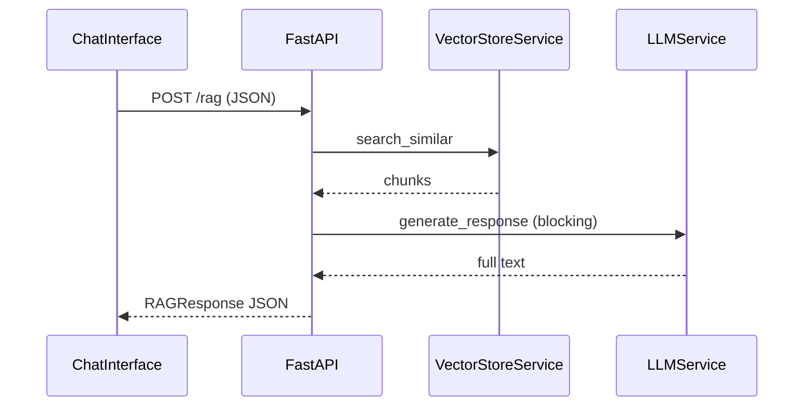
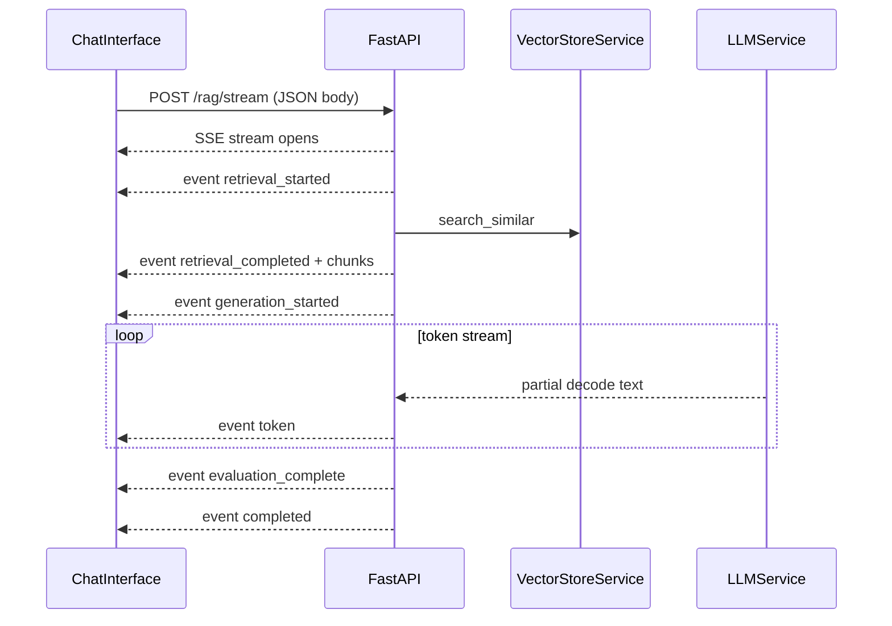

# RAG Streaming Responses (SSE) — Implementation Plan

## Goal

Transform the chat UX from “wait → full JSON answer” to a **ChatGPT/Claude-style streaming experience** where the user sees pipeline progress and the answer growing in real time—while leveraging this project’s differentiator: **observable, explainable RAG stages** (not raw token spam only).

## Current State

| Area | Today |
|------|--------|
| Endpoint | [`main.py`](main.py) `POST /rag` returns full [`RAGResponse`](main.py) JSON after retrieval + generation complete |
| LLM | [`llm_service.py`](src/services/llm_service.py) uses `pipeline(...)` synchronously — blocks until full text |
| Frontend | [`ChatInterface.tsx`](frontend/src/components/ChatInterface.tsx) calls [`apiService.ragQuery`](frontend/src/services/api.ts) via `fetch`, shows spinner, renders full message once |
| Evaluation | [`evaluation_service.detect_hallucination`](src/services/evaluation_service.py) exists but is **not** wired into `/rag` response or UI |



## Target Architecture



**Transport:** SSE over HTTP (`text/event-stream`), implemented with FastAPI [`StreamingResponse`](https://fastapi.tiangolo.com/advanced/custom-response/#streamingresponse).

**Client:** `fetch` + `ReadableStream` parser (not `EventSource`) because the stream must be started with a **POST** body `{ query, k, max_length }`.

**Keep** existing `POST /rag` unchanged for tests, scripts, and backward compatibility.

---

## 1. Backend — SSE Protocol Design

### New endpoint

`POST /rag/stream` in [`main.py`](main.py)

- Request body: same as [`RAGRequest`](main.py) (`query`, `k`, `max_length`)
- Response: `StreamingResponse(event_generator(), media_type="text/event-stream")`
- Headers (critical for HF Spaces / reverse proxies):

```python
{
  "Cache-Control": "no-cache",
  "Connection": "keep-alive",
  "X-Accel-Buffering": "no",  # disable nginx buffering
}
```

### Structured event schema

Each SSE message:

```
event: <type>
data: <json>

```

| Event | When | Payload (key fields) |
|-------|------|------------------------|
| `retrieval_started` | Immediately | `query`, `k`, `timestamp` |
| `retrieval_completed` | After FAISS search + threshold filter | `chunks` (same shape as today), `count`, `filtered_count`, `latency_ms`, `avg_distance`, `retrieval_confidence` |
| `generation_started` | Before LLM | `model`, `context_chunks` |
| `token` | Each decoded partial | `text` (incremental fragment to append) |
| `evaluation_complete` | After full text | `grounding_score`, `hallucination_detected`, `confidence_label`, `confidence_score` |
| `completed` | Stream end | `total_latency_ms`, `embedding_ms`, `search_ms`, `llm_ms`, `tokens_used`, `model_info` |
| `error` | Any failure | `message`, `stage` (`retrieval` / `generation` / `evaluation`) |

**Design choice:** Stream **raw generated tokens** during generation; run hallucination/grounding checks **after** generation completes and emit `evaluation_complete` (do not rewrite already-streamed text—show a UI badge/warning instead). This matches real production chat apps and avoids jarring mid-stream answer swaps.

Reuse existing logic from [`main.py` `/rag`](main.py) (lines 307–335): similarity threshold `1.5`, 404-style behavior becomes `error` event with stage `retrieval` if no chunks pass filter.

---

## 2. Backend — New Modules / Changes

### A. SSE helper — `src/utils/sse.py` (new)

Small utility:

- `format_sse(event: str, data: dict) -> str`
- `yield_error(stage, message)`
- Ensures JSON serialization + double-newline framing

### B. Stream orchestrator — `src/services/rag_stream_service.py` (new)

Async/sync generator orchestrating the pipeline:

1. `yield retrieval_started`
2. Time + call `vector_store.search_similar(query, k)` (same as `/rag`)
3. Apply similarity filter (extract duplicated filter block from `main.py` into shared helper to avoid drift)
4. `yield retrieval_completed` with chunk metadata + latencies
5. `yield generation_started`
6. Delegate to `llm_service.generate_response_stream(...)` and forward each `token` event
7. Run grounding evaluation on final assembled string (extract shared function from [`evaluation_service.detect_hallucination`](src/services/evaluation_service.py) or add thin wrapper in orchestrator)
8. `yield evaluation_complete` + `completed` (reuse [`observability.track_rag_pipeline`](src/utils/observability.py) for latency breakdown)

**Disconnect handling:** Check `await request.is_disconnected()` between events; stop generation thread if client aborts.

### C. LLM streaming — extend [`llm_service.py`](src/services/llm_service.py)

Add `generate_response_stream(query, search_results, max_length) -> Iterator[str]`:

- Access underlying model/tokenizer from `self.generator.model` and `self.generator.tokenizer`
- Use Hugging Face [`TextIteratorStreamer`](https://huggingface.co/docs/transformers/main/en/internal/generation_utils#transformers.TextIteratorStreamer) + `threading.Thread` around `model.generate(...)`
- Tokenizer: encode prompt from existing `create_prompt` / `format_context`
- Generation kwargs aligned with current settings (`max_length`, `temperature=0.1`, `top_k`, `top_p`, `repetition_penalty`)
- Yield decoded text fragments as they arrive (true incremental output on CPU/GPU)

```python
# Conceptual pattern (not final code)
streamer = TextIteratorStreamer(tokenizer, skip_prompt=True, skip_special_tokens=True)
thread = Thread(target=model.generate, kwargs={..., "streamer": streamer})
thread.start()
for text in streamer:
    if text:
        yield text
thread.join()
```

**Note:** First token latency on CPU may still be ~1–3s; streaming improves **perceived** speed immediately once retrieval events arrive (~300–800ms if retrieval is fast).

### D. Wire endpoint in [`main.py`](main.py)

```python
@app.post("/rag/stream")
async def rag_stream(request: RAGRequest, raw_request: Request):
    return StreamingResponse(
        rag_stream_service.stream(raw_request, request),
        media_type="text/event-stream",
        headers={...},
    )
```

Update root `/` endpoint list in `main.py` to document `/rag/stream`.

---

## 3. Frontend — Streaming Client

### A. Types + parser — [`frontend/src/services/api.ts`](frontend/src/services/api.ts)

Add:

- `StreamEventType` union matching backend events
- `streamRagQuery(request, callbacks, signal?)` using:
  - `fetch(`${API_BASE_URL}/rag/stream`, { method: 'POST', body: JSON.stringify(request), signal })`
  - Read `response.body` via `getReader()` + `TextDecoder`
  - Parse SSE frames (buffer partial lines; split on `\n\n`)
  - Invoke callbacks: `onEvent`, `onToken`, `onComplete`, `onError`

**Do not use** native `EventSource` (GET-only).

Optional lightweight dependency alternative: `@microsoft/fetch-event-source` — only add if manual parser becomes brittle; prefer zero-dep parser first.

### B. Chat UI — [`ChatInterface.tsx`](frontend/src/components/ChatInterface.tsx)

State additions:

| State | Purpose |
|-------|---------|
| `pipelineStage` | `idle \| retrieving \| generating \| evaluating \| done \| error` |
| `streamingMessageId` | Assistant placeholder message being filled |
| `abortController` | Cancel in-flight stream |

Flow on send:

1. Append user message
2. Create assistant placeholder: `{ content: '', isStreaming: true }`
3. Set `pipelineStage = 'retrieving'`
4. Call `streamRagQuery(...)`
5. On `retrieval_completed`: update [`RetrievedChunks`](frontend/src/components/RetrievedChunks.tsx) via `onRetrievedChunks`, show “3 chunks retrieved”
6. On `generation_started`: `pipelineStage = 'generating'`
7. On `token`: append `data.text` to assistant `content` (incremental render)
8. On `evaluation_complete`: attach metadata badge (grounded / possible hallucination)
9. On `completed`: finalize metadata (latency, tokens), `isStreaming = false`, remove cursor
10. On `error`: show error bubble + reset stage

### C. UX components (inline or small new file)

**Pipeline status bar** above the streaming bubble:

- “Searching documents…”
- “3 chunks retrieved”
- “Generating answer…”
- “Evaluating grounding…”

**Streaming cursor** (high impact, low effort): when `isStreaming`, render trailing `▌` with CSS blink animation after message text.

**Stop button** (recommended): while streaming, replace send icon with “Stop”; call `abortController.abort()`. Backend stops yielding on disconnect.

### D. Keep non-stream path optional

Default chat to `/rag/stream`. Keep `ragQuery` in `api.ts` for debugging/fallback only.

---

## 4. CORS & Deployment (HF + Vercel)

Already configured in [`main.py`](main.py) for `https://rag-system-blush.vercel.app`.

Verify after implementation:

- Vercel `REACT_APP_API_URL` points to HF Space URL
- HF Space serves `/rag/stream` without proxy buffering (headers above)
- Local dev: `localhost:3000` → `localhost:8000` stream works

If HF still buffers events, fallback mitigation: yield slightly larger chunks (word-boundary flush every N tokens) — document in README troubleshooting.

---

## 5. Testing Plan

| Test | How |
|------|-----|
| SSE contract | `curl -N -X POST .../rag/stream -H "Content-Type: application/json" -d '{"query":"...","k":3}'` — verify ordered events |
| Empty retrieval | Query with no stored docs → `error` event, no hang |
| Client abort | Start stream, cancel mid-generation → connection closes cleanly |
| UI | Upload doc → ask question → see stage labels + growing answer + chunks panel update |
| Regression | Existing `POST /rag` + `test_scripts/test_rag.py` still pass |

---

## 6. Documentation Updates

- [`README.md`](README.md): add “Streaming RAG” section with event table + curl example
- [`HELP.md`](HELP.md): fix outdated mock-embedding note; document `/rag/stream`
- [`frontend/SETUP.md`](frontend/SETUP.md): mention streaming endpoint + env var

---

## File Change Summary

| File | Action |
|------|--------|
| [`src/utils/sse.py`](src/utils/sse.py) | **Create** — SSE formatting |
| [`src/services/rag_stream_service.py`](src/services/rag_stream_service.py) | **Create** — pipeline orchestrator |
| [`src/services/llm_service.py`](src/services/llm_service.py) | **Extend** — `generate_response_stream` |
| [`main.py`](main.py) | **Extend** — `POST /rag/stream`, shared retrieval filter helper |
| [`frontend/src/services/api.ts`](frontend/src/services/api.ts) | **Extend** — stream client + types |
| [`frontend/src/components/ChatInterface.tsx`](frontend/src/components/ChatInterface.tsx) | **Refactor** — streaming UX |
| [`README.md`](README.md), [`HELP.md`](HELP.md) | **Update** — streaming docs |

**Out of scope** (future phases): WebSockets, multi-turn memory, replacing Flan-T5 with OpenAI streaming API, evaluation dashboard UI.

---

## Implementation Order

1. SSE helper + event schema constants
2. `LLMService.generate_response_stream` (prove token streaming locally)
3. `RagStreamService` orchestrator + `/rag/stream` endpoint
4. Frontend SSE parser in `api.ts`
5. `ChatInterface` streaming UX (stages, incremental text, cursor)
6. Abort/cancel + disconnect handling
7. Docs + manual HF/Vercel verification
