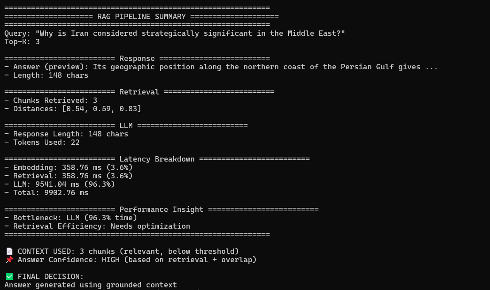
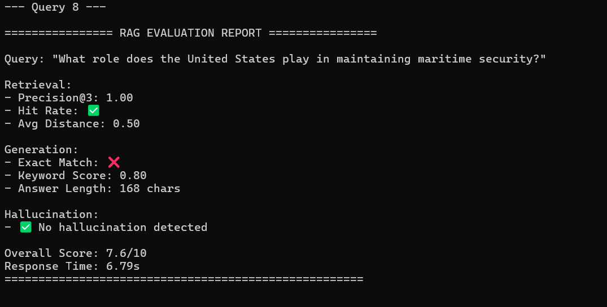
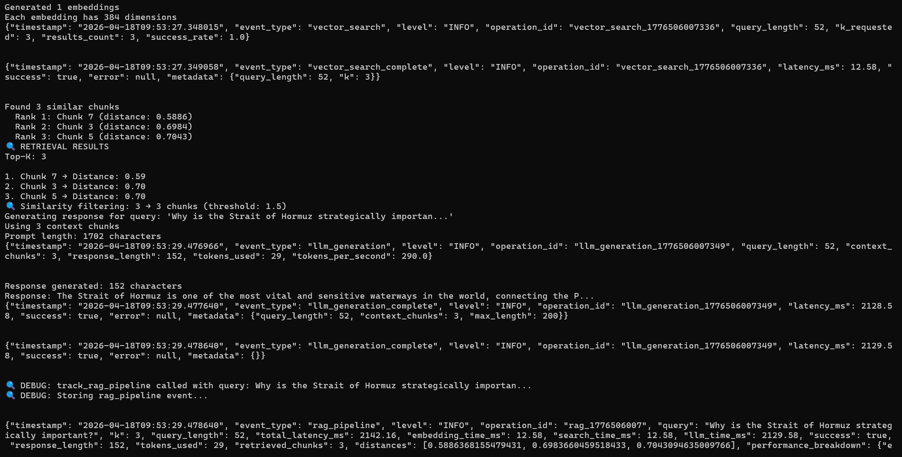
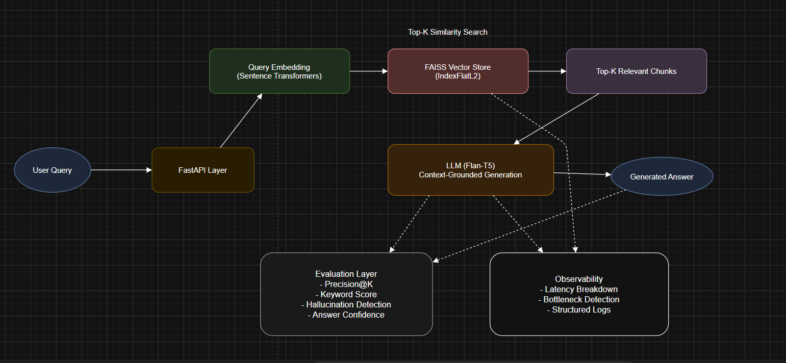

# 🚀 RAG System (Production-Oriented)

## ⭐ Highlights

- Built RAG system with **evaluation + observability-first design**
- Implemented **hallucination detection via grounding analysis**
- Designed **retrieval quality scoring using distance + Precision@K**
- Identified **LLM as system bottleneck (~98% latency)**

---

A fully modular **Retrieval-Augmented Generation (RAG)** system built from scratch using **FastAPI, FAISS, and Hugging Face Transformers**.

 ⚡Focus: Designing a RAG system with **evaluation, observability, and hallucination detection** — not just retrieval + generation.

💡 **Why this matters:**
In production RAG systems, failures usually come from:
- poor retrieval quality
- hallucinated responses  
- lack of visibility into pipeline behavior

This system explicitly addresses these gaps through evaluation and observability.

---

## 📸 System Demo

### 🔍 RAG Pipeline Execution



### 📊 Evaluation Metrics Output


### ⚡ API + Logs (Observability)


---

## 🧠 Problem Statement

Most RAG implementations:
- Work as black boxes
- Lack evaluation
- Provide no visibility into retrieval or hallucination

This system solves that by:
- ✅ Making retrieval transparent
- ✅ Measuring generation quality
- ✅ Detecting hallucinations
- ✅ Providing latency & bottleneck insights

---

## 🏗️ System Architecture



### Core Components

- **Text Processing**
  - Chunking (50-word semantic chunks)
  - Embedding generation (384-dim vectors)

- **Vector Store**
  - FAISS (IndexFlatL2)
  - Top-K similarity search

- **LLM Service**
  - Flan-T5-Base (770M parameters)
  - Context-grounded generation

- **Evaluation Engine**
  - Retrieval + Generation + Hallucination metrics

---

## 🔄 End-to-End Pipeline

```text
User Query
↓
Query Embedding
↓
Vector Search (Top-K)
↓
Relevant Chunks
↓
Prompt Construction
↓
LLM Generation
↓
Evaluation (Precision, Hallucination, etc.)
```

---

## 🤔 Key Design Decisions

- **Chunk Size (50 words)**  
  Chosen to balance semantic completeness vs retrieval precision.

- **FAISS IndexFlatL2**  
  Used for exact similarity search with interpretable distance metrics.

- **Flan-T5-Base**  
  Lightweight model enabling local inference while maintaining instruction-following capability.

- **Top-K Retrieval (K=3)**  
  Provides sufficient context without overwhelming the LLM.

---

## ⚙️ Engineering Highlights

- Built **RAG pipeline from scratch** (no LangChain abstraction)
- Implemented **FAISS-based similarity search**
- Designed **custom evaluation framework**
- Added **hallucination detection using grounding analysis**
- Built **observability layer (latency + bottleneck detection)**
- Achieved **100% Precision@K on domain dataset**
- Identified **LLM as performance bottleneck (~98% latency)**

---

## 🔍 Example: RAG Execution

**Query:**

What is the Strait of Hormuz?


**Retrieved Chunks:**
- Distance: 0.59
- Distance: 0.65
- Distance: 0.72

**Generated Response:**

It connects the Persian Gulf to the Gulf of Oman and the Arabian Sea.

**Insight:**
All retrieved chunks were highly relevant (low distance), resulting in grounded and accurate generation.

---

## 📊 Evaluation Framework

### 🔹 Retrieval Metrics
- **Precision@K**
- **Hit Rate**
- **Average Distance**

### 🔹 Generation Metrics
- **Exact Match**
- **Keyword Score**
- **Response Length**

### 🔹 Hallucination Detection
- Context grounding check
- Word overlap analysis
- Novel word detection

---

## 🧪 Example Evaluation Output


Precision@3: 1.00
Hit Rate: ✅
Keyword Score: 1.00
Hallucination: ❌
Overall Score: 10/10

**Decision Insight:**
Answer generated using grounded context → HIGH confidence

---

## 📈 Observability & Insights

- Latency breakdown:
  - Embedding: ~1–5%
  - Retrieval: ~1–5%
  - LLM: ~95–98%

- Automatic detection:
  - Bottleneck: LLM
  - Retrieval Quality: High / Moderate / Low

- Key Insight:
  - LLM dominates latency (~98%) → primary optimization target

---

## ⚡ API Endpoints

| Endpoint | Description |
|--------|------------|
| `/store-chunks` | Store document chunks |
| `/search` | Retrieve similar chunks |
| `/rag` | Full pipeline |
| `/store-stats` | Vector DB stats |
| `/health` | System health |

---

## 🛠️ Tech Stack

- FastAPI
- FAISS
- Sentence Transformers
- Hugging Face Transformers
- PyTorch
- NumPy

---

## 📁 Project Structure


```
RAG_System/
|
+-- main.py                 # FastAPI application
+-- requirements.txt        # Dependencies
+-- README.md              # This file
|
+-- src/
|   +-- services/
|   |   +-- vector_store_service.py
|   |   +-- llm_service.py
|   |   +-- simple_embedding_service.py
|   |   +-- user_input_service.py
|   |   +-- rag_explainer.py
|   |   +-- faiss_explainer.py
|   |   +-- embedding_service.py
|   |
|   +-- utils/
|       +-- text_chunker.py
|
+-- test_scripts/
|   +-- test_api.py
|   +-- test_search.py
|   +-- test_rag.py
|   +-- examples.py
|
+-- venv/                  # Virtual environment
```


---

## ⚠️ Current Limitations (Intentionally Identified)

- In-memory FAISS → not scalable for large datasets
- No hybrid retrieval → keyword misses possible
- No re-ranking → top-K may include weak chunks
- Small LLM → limited reasoning depth

💡 These were intentionally left to highlight system bottlenecks and guide future improvements.

---

## 🚀 Future Improvements (Next Iterations)

- Hybrid retrieval (BM25 + vector) to reduce semantic misses
- Cross-encoder re-ranking to improve top-K precision
- LLM-as-a-judge for semantic evaluation
- Streaming responses for better UX
- Persistent vector DB (Weaviate / Pinecone)

---

## 🧩 Key Learning

- High retrieval quality directly reduces hallucination risk
- Distance thresholds can act as confidence signals
- LLM latency dominates → optimization should focus there
- Evaluation is not optional for production RAG systems

---

## 📬 Let's Connect

Open to discussions on:
- RAG systems
- LLM evaluation
- GenAI system design

---

## Documentation

For complete technical documentation, API reference, and usage examples:

**[View Help Documentation](./HELP.md)**

---
